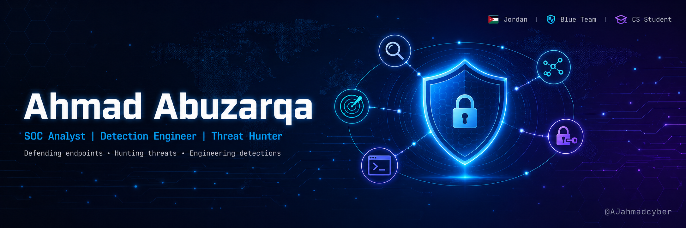

<div align="center">



</div>
<div align="center">

# 👋 Hi, I'm Ahmad

### 🛡️ SOC Analyst Trainee | Detection Engineering Enthusiast | Cybersecurity Student

*Based in Jordan 🇯🇴 | Building defensive security solutions one log at a time*

[](https://github.com/AJahmadcyber)
[](https://github.com/AJahmadcyber)

</div>

---

## 🎯 About Me

```yaml
name: Ahmad Abuzarqa
role: SOC Analyst Trainee
location: Jordan 🇯🇴
education: B.Sc. Cybersecurity (Graduating Oct 2026)
focus_areas:
  - Threat Detection & Response
  - Detection Engineering
  - Ransomware Defense Research
  - Linux Endpoint Security (eBPF)
currently_learning:
  - CyberDefenders CCDL1
  - Advanced Threat Hunting
  - Sigma Rule Development
```

---

## 🛠️ Tech Stack & Tools

### 🔍 Security Operations


### 💻 Languages & Scripting


### 🐧 Systems & Infrastructure


### 🎯 Frameworks & Methodologies


---

## 🚀 Featured Projects

### 🛡️ [Hybrid R-Sentry](https://github.com/Mohhudib/hybrid-rsentry)
> Real-time ransomware detection and auto-containment system for Linux endpoints. Combines entropy analysis, canary files, process lineage scoring, and AI threat classification.
> 
> **Stack:** Python • eBPF • FastAPI • Celery • Redis • PostgreSQL • React

### 🏠 [SOC Home Lab (MDR Stack)](https://github.com/AJahmadcyber/homelab-mdr)
> Open-source Managed Detection & Response home lab. Full stack: Wazuh + TheHive + Cortex + n8n SOAR + pfSense/Suricata. Mapped to MITRE ATT&CK techniques.
> 
> **Stack:** Wazuh • Docker • TheHive • Cortex • n8n • pfSense • Suricata

### 🔍 [Endpoint Triage Walkthrough](https://github.com/AJahmadcyber/endpoint-triage-walkthrough)
> A real-world PUP incident response case study following the PICERL framework. Demonstrates CPU time accumulator analysis, multi-layer persistence hunting, and MITRE ATT&CK mapping.
> 
> **Stack:** PowerShell • MITRE ATT&CK • Sigma • Windows Forensics

---

## 📊 GitHub Stats

<div align="center">


</div>

---

## 🎓 Certifications & Learning Path

### 🎯 In Progress
- 🛡️ **CyberDefenses CCDL1** — Blue Team Level 1 (Active)

### ✅ Completed
- 🔐 **Microsoft SC-900** — Security, Compliance, and Identity Fundamentals
- 🌐 **Cisco Cybersecurity Essentials**

### 📚 Self-Learning Focus
- TryHackMe SOC Level 1 Path
- BTL1 (Blue Team Level 1) Labs
- CyberDefenders Blue Team Labs

---

## 🌱 Currently Exploring

```bash
$ whoami --interests
├── 🔍 Threat Hunting (Sigma + KQL + SPL)
├── 🧬 Detection Engineering at Scale
├── 🐧 eBPF for Endpoint Security
├── 🤖 SOAR Automation (n8n + TheHive)
└── 📊 Statistical Anomaly Detection for SOC
```

---

## 📫 Let's Connect

[](mailto:ahmad.j.abuzarqa@gmail.com)
[](https://github.com/AJahmadcyber)

---

<div align="center">

### 💭 Quote I Live By

> *"In cybersecurity, paranoia is a feature, not a bug."*

⭐ **From a SOC analyst, for the blue team community** ⭐

</div>
